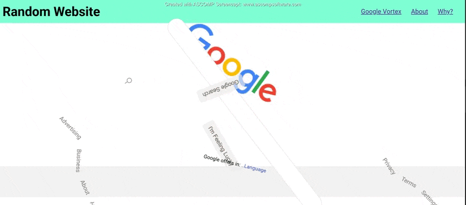

# .NET-Web-Starter

> CPTC Project for learning C#/.NET Web Development

I chose to make this vortex for this sort project.
The idea initial came from build an identical thing for a Google Chrome Extension, 
share this worked on the real Google Search site, and any site you would visit.

Since I needed a project idea, I just repeated that one. Which was convenient because I wanted you to 
be able to experience this without using the extension. 

I initially thought to Iframe Google Search, but was blocked by an Iframe policy. 
So I grabbed a clone for this project, and animated it.

